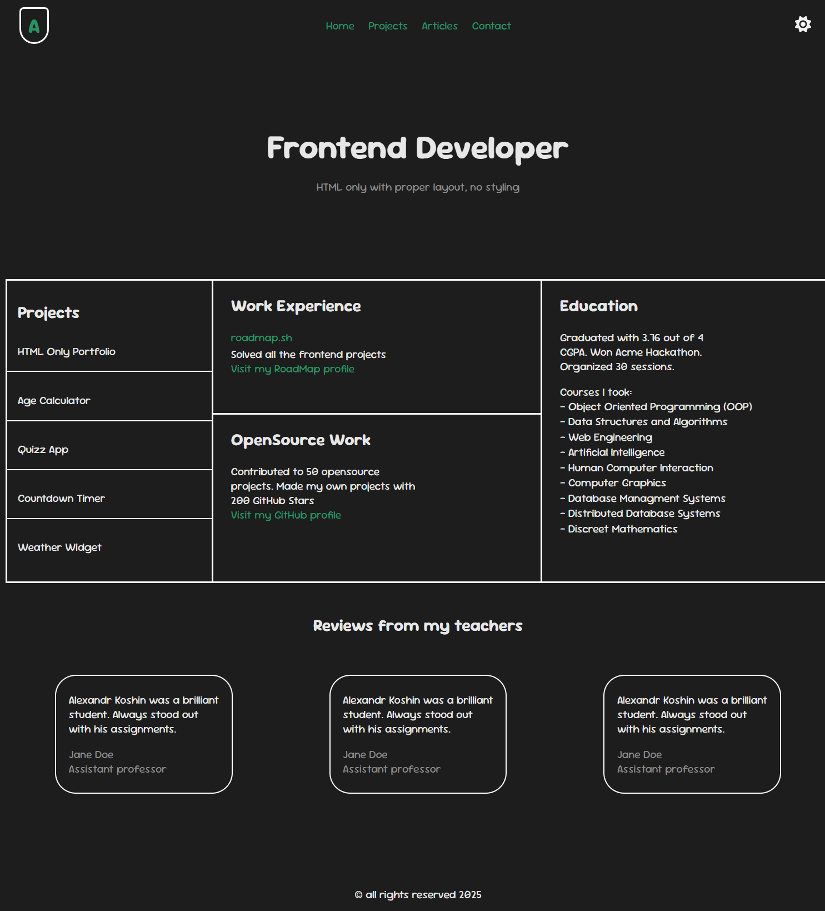
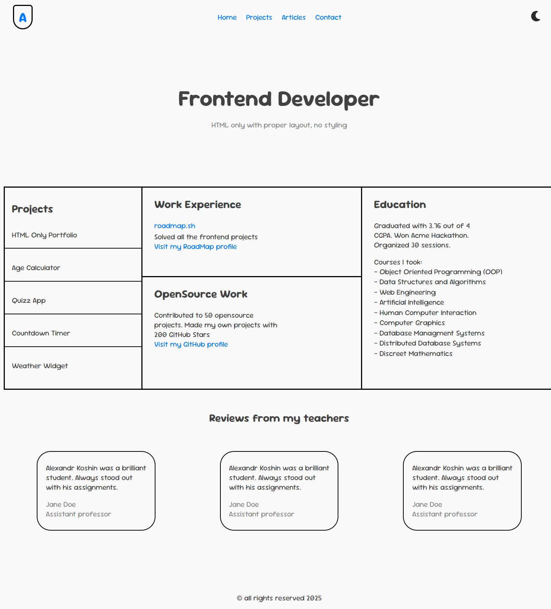

## *Personal portfolio - [Roadmap.sh](https://roadmap.sh/projects/portfolio-website)*
## *Link to site: [Personal.com](https://alexandrkoshin.github.io/PersonalP/)*
### The Goals of this project:
    -- A fully styled, responsive website with the same structure as the previous project.
    -- Consistent use of a chosen color scheme and typography.
    -- Proper use of CSS techniques like Flexbox, media queries, and the box model.
    -- A responsive navigation bar and well-styled contact form.
    -- Use Google Fonts to enhance the typography of your website.
    -- Look into GitHub Pages or Cloudflare Pages to host your website for free.
    -- Add support for dark mode using CSS variables.
---
### Preview Dark Mode 
--- 
### Preview Light Mode 
